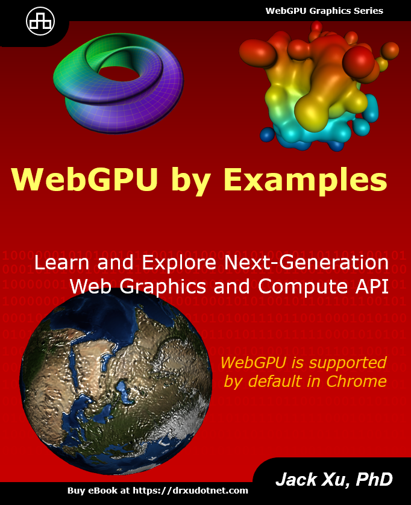

<!---$$\textcolor{red}{\text{The source code has just been updated to WebGPU version 0.1.31.}}$$--->

# WebGPU by Examples: New Video Series on WebGPU

WebGPU is a new web graphics API that offers significant benefits over its predecessor, WebGL. WebGPU is designed to provide modern low-overhead graphics and compute capabilities on the web platform. This means that web developers can create more complex and realistic 3D graphics in web applications without having to worry about performance issues.

WebGPU is now widely available to developers through Chromium-based browsers like Chrome and Edge. This has a significant impact on web graphics, data visualization, and video games. WebGPU will allow developers to create more complex and realistic 3D graphics in web applications. This will make web applications more immersive and engaging, and it will open up new possibilities for creativity and innovation. 

Previously, I made a [YouTube video series](https://github.com/jack1232/WebGPU-Step-By-Step) that covered the basics of graphics programming with WebGPU. However, both WebGPU and WGSL have undergone significant changes since then. Consequently, the application examples we discussed in that series will no longer function without updates.

As WebGPU matures and gains stability, along with the official support from major web browsers, I have decided to make a new YouTube video series on WebGPU. throughout this series, I will explain how to create a variety of advanced 3D graphics on the GPU. We will delve into topics such as supershapes, procedural terrains, complex function visualization, marching cubes, implicit 3D surfaces, Minecraft, voxel terrains, and particle systems implemented using compute shaders.

In this new series, we will focus on advanced graphics programming and omit the explanation of basics such as development environment setup, 3D transformations, etc. If you are not familiar with the WebGPU basics, please refer to [my previous video series](https://github.com/jack1232/WebGPU-Step-By-Step).

Most examples used in this new video series are taken from my recently published book ["WebGPU by Examples"](https://drxudotnet.com).

 

## YouTube Video Links and Live Demos:

Please visit my YouTube channel: [Practical Programming with Dr. Xu](https://www.youtube.com/c/PracticalProgrammingWithDrXu) and view the [live demos](https://webgpu-gpu-book.drxudotnet.com).

 

### Video Series for WebGPU by Examples:

1. Introduction: https://youtu.be/PwKjAlZfiwY
2. Starter Template: https://youtu.be/3EKicuZjMdY
3. WebGPU-Simplified Package: https://youtu.be/4WVFzyamY74
4. Update GPU Buffers: https://youtu.be/GifrQxEOEA4
5. Blinn-Phong Light Model: https://youtu.be/7aAZRuesaak
6. https://youtu.be/1_rjiatj1IM

 

## Building

This repository organizes all examples used in this new video series. The application is built with TypeScript and bundled using WebPack. Building the app requires an installation of Node.js.

The following steps shows how to run the sample apps:

* Clone or download the repository to your local machine.
* Install dependencies with the command: **npm install**.
* Compile and bundle the app with the command: **npm run dev**, **npm run prod**, or **npm run watch**.
* Run the live-server from VS-Code and then navigate to **http://localhost:5500** or **http://127.0.0.1:5500** to view the app.
* You can also execute the serve task and navigate your web browser to localhost:/8080 with the command: **npm run serve**.

 

## Sample Projects 
Here are some sample objects created using the WebGPU API, which I will discussed in my video series.

### Gravity on a 2D Grid (attraction):
  

### Gravity on a 2D Grid (repulsion):
 

### Electric Field Distribution:
 

### Metaballs Created Using Marching Cubes:
  

### Procedural Terrains with LOD:
 

### Procedural 3D Volcano:

 

## License

The MIT License (MIT).

Copyright (c) 2023 Jack Xu.

Permission is hereby granted, free of charge, to any person obtaining a copy of this software and associated documentation files (the "Software"), to deal in the Software without restriction, including without limitation the rights to use, copy, modify, merge, publish, distribute, sublicense, and/or sell copies of the Software, and to permit persons to whom the Software is furnished to do so, subject to the following conditions:

The above copyright notice and this permission notice shall be included in all copies or substantial portions of the Software.

THE SOFTWARE IS PROVIDED "AS IS", WITHOUT WARRANTY OF ANY KIND, EXPRESS OR IMPLIED, INCLUDING BUT NOT LIMITED TO THE WARRANTIES OF MERCHANTABILITY, FITNESS FOR A PARTICULAR PURPOSE AND NONINFRINGEMENT. IN NO EVENT SHALL THE AUTHORS OR COPYRIGHT HOLDERS BE LIABLE FOR ANY CLAIM, DAMAGES OR OTHER LIABILITY, WHETHER IN AN ACTION OF CONTRACT, TORT OR OTHERWISE, ARISING FROM, OUT OF OR IN CONNECTION WITH THE SOFTWARE OR THE USE OR OTHER DEALINGS IN THE SOFTWARE.
 
